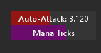

# AA/MP tick timer for Triggevent

Simple addon for displaying AA time and/or MP ticks.

AA timer may not be accurate with all haste buffs.

You can enable/disable AA and MP, and customize the colors for each.

## Installation

To install the addon, do the following in Triggevent (must be a proper installation, not IDE):

1. Navigate to Plugin Settings > Manage Addons
2. Click "Add From URL" and enter `https://xpdota.github.io/triggevent-aa-tick-timer/master/INFO`
3. Go to Updates > Check for Updates and Restart
